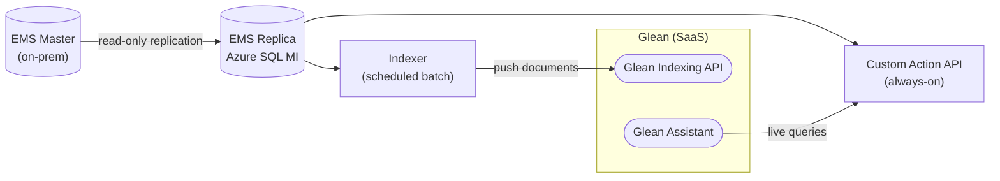
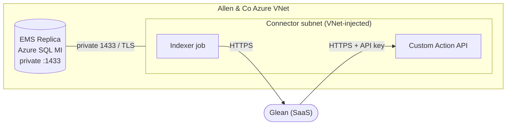
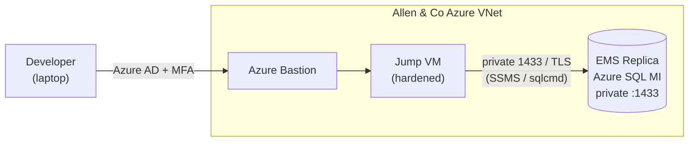

# Glean Custom Connector for Allen & Co — Database Connectivity Architecture

## 1. Purpose of this document

I am building the Glean custom connector for **Allen & Co**, modeled on the connector we already run in production for SMART. This brief documents the **production architecture** we've settled on — the connector runs **inside Allen & Co's Azure network**, as VNet-injected containers with direct, private access to the database — and how our developers reach the private database during build and test.

> 💡 The important thing to know up front: connectivity is **configuration, not code** — the same application runs unchanged regardless of where it's hosted. We deploy it inside Allen & Co's Azure environment so it talks to the Managed Instance over the private network, with nothing database-facing ever exposed to the internet.

---

## 2. Background

Allen & Co are standing up a **read-only replica** of their EMS database in Azure:

- Their on-premises **EMS Master** replicates (read-only) into an **EMS Replica** hosted on an **Azure SQL Managed Instance (MI)**.
- We read four views from that replica: `v_Attendee`, `v_Attendee_Event`, `v_Company`, `v_Participation`.
- Document-level **permissions are sourced from Active Directory / Entra ID**, so each Glean user only sees what they are entitled to. Glean access is tied to `allenandco.com` identities.

The connector has two components, both of which I am reusing from our existing solution:

- **Indexer** — a scheduled batch job that reads the views, builds documents, and pushes them to the **Glean Indexing API**.
- **Custom Action API** — an always-on service that answers **live queries** from the Glean assistant against the replica.

The key technical fact that drives this whole document: an **Azure SQL Managed Instance lives inside a private virtual network (VNet)**. It has a private IP on port `1433` and is **not reachable from the public internet** unless someone explicitly exposes it. The connector is therefore **deployed inside that private network**, so it reaches the database directly over its private address — and the public endpoint stays disabled.

---

## 3. Production deployment — connector runs inside the VNet

The connector is deployed into Allen & Co's Azure environment, attached to the same VNet as the Managed Instance. It talks to the database over the **private network** — no tunnels, no public database exposure.

**How it is built**

- **Indexer**: built by a CI/CD pipeline in Allen & Co's environment (**Azure DevOps** → `az acr build` → image in **Azure Container Registry**) and run as a **scheduled Container Apps job** (it runs, indexes, and exits).
- **Custom Action API**: the same FastAPI service running as an **Azure Container App**, reachable by Glean over HTTPS.
- **Networking**: the connector is **VNet-injected** into a subnet in (or peered to) the MI's VNet and reaches the database on its **private IP, port 1433**. The MI's public endpoint stays **disabled**. A network security group (NSG) allows only the connector's subnet to reach the database.
- **Encryption**: because we connect to the instance's real hostname, we get **full TLS with certificate validation** (`Encrypt=yes`, no certificate workaround).
- **Secrets**: stored in **Azure Key Vault** (or replaced entirely by a managed identity), never in plaintext configuration.
- **Observability**: logs and metrics flow to **Azure Monitor / Log Analytics / Application Insights**, and failures raise alerts to **Slack / Site24x7**.
- **Ownership**: in production, **Allen & Co builds, deploys, and operates** the container service; Nimble Gravity provides the source code and build/deploy tooling. No Nimble Gravity infrastructure sits in the production data path.

**Strengths**: nothing database-facing is ever exposed to the internet; the always-on API is highly reliable (no tunnel to babysit); it scales elastically; and the design is configuration-driven, so it stamps out cleanly for future clients. **Requirement**: the ability to deploy into Allen & Co's Azure subscription and a small amount of cloud infrastructure on their side.

---

## 4. Developer access — Azure Bastion + jump VM

The production connector reaches the database directly (§3), but our **developers** can't: the Managed Instance is private, so it isn't reachable from a laptop. For build and test work we connect through **Azure Bastion** to a small hardened **jump VM** inside the VNet, and run SSMS / `sqlcmd` against the database's private endpoint from there.

- **Azure Bastion** brokers the connection over TLS from the Azure portal — the jump VM needs **no public IP**, and ports 22/3389 are never exposed to the internet.
- Access is **human-only and MFA-gated** through Azure AD / Entra ID; there is no standing public RDP/SSH.
- The jump VM is a **development convenience only** — it is **not** part of the production data path. Production containers reach the database directly, as in §3.
- Developers use a dedicated **read-only** SQL login, so even interactive access can only `SELECT` from the views in scope.
- This access is **temporary** — the jump VM, developer guest accounts, and Bastion dev access are removed once the connector is live in production.

---

## 5. Security considerations

Security is a primary driver of the design, so I'm treating these as non-negotiable:

- **Least-privilege database access.** A dedicated, **read-only** SQL login that can only `SELECT` from the four views — not the underlying tables. The connector can never write, and its blast radius is limited to those four views.
- **Keep the database private.** The Managed Instance is never reachable from the public internet; its public endpoint stays disabled. Network security groups restrict traffic to exactly the source that needs it.
- **Encryption in transit.** All database traffic uses TLS, validated against the instance's real server certificate (`Encrypt=yes`, no certificate workaround).
- **Secrets are never in source.** Credentials live in **Azure Key Vault** (or are replaced entirely by a managed identity), never in plaintext configuration.
- **Developer access is separate.** Human access to the database is via **Azure Bastion + jump VM** (MFA-gated, no public RDP/SSH) and is not part of the production data path.
- **The Custom Action API is locked down.** It is HTTPS-only, requires a bearer API key, is restricted to **Glean's published egress IP ranges**, and logs the calling user for audit.
- **Permissions mirror Active Directory.** Document access in Glean is derived from Allen & Co's AD/Entra groups, so users only ever see what they're entitled to see.

---

## 6. Scalability considerations

I want this to scale both with Allen & Co's data growth and across future clients, so I've designed with that in mind:

- **Indexer** scales with data volume and schedule. It can scale its resources per run and **scale to zero between runs**, which keeps cost proportional to usage.
- **Custom Action API** scales with query concurrency. It uses **database connection pooling** so it reuses connections instead of opening a new one per request, and it can **add replicas automatically** under load.
- **Managed Instance sizing.** The replica's capacity (vCores, connection limits) is independently tunable, and because it's read-only it absorbs our load without touching Allen & Co's production system.
- **Repeatability across clients.** Because the connector is configuration-driven, the same design replicates to future clients. An Azure-native, infrastructure-as-code deployment is the cleanest to stamp out repeatedly with minimal incremental effort.

---

## 7. Summary

**The connector runs inside Allen & Co's network.** It gives us the strongest security posture (the database is never exposed to the internet), the best reliability for the always-on API, and the cleanest path to scale. Production runs as VNet-injected Azure containers with direct, private, read-only access to the Managed Instance; developers reach the database during build and test through Azure Bastion and a jump VM.

This requires the ability to deploy into Allen & Co's Azure subscription. The application itself is configuration-driven, so we can start building immediately and finalize the Azure-side provisioning in parallel.

---

## 8. What I need to move forward

To finalize the setup, I need decisions on:

1. **Deployment into Allen & Co's Azure subscription** — confirming we can deploy the connector containers (Container Apps + Container Registry) into their environment.
2. **Authentication** — production uses a passwordless **managed identity** (decided); the read-only `glean_dev` SQL login is dev-only and removed at go-live. No production database credentials are shared with Nimble Gravity.
3. **Developer access** — provisioning the jump VM + Azure Bastion for our team's build/test access.
4. **Monitoring channels** — confirm we're sending alerts to Slack and/or Site24x7.
