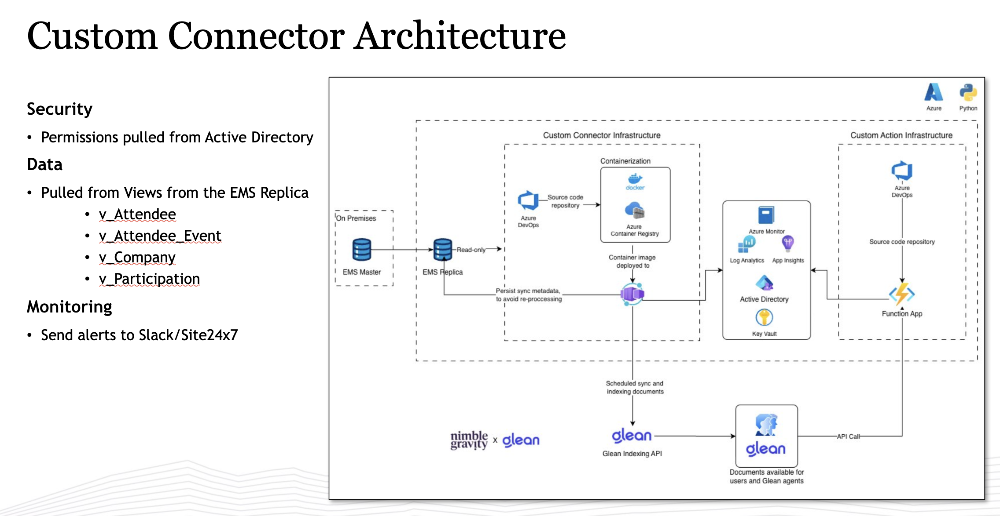

# Allen & Co Glean Connector — User & Administration Manual

*Prepared by Nimble Gravity for Allen & Co.*

This manual explains how to **use** the Allen & Co Glean Connector as an analyst (Part A) and how
to **register, configure, and operate** it as an administrator (Part B). It is the analyst-facing
companion to the technical documents in [`docs/`](.) (architecture, connectivity, and the
document model).

---

## Document control

| Version | Date | Action | Author | Description | Approved by |
|---|---|---|---|---|---|
| 1.0 | 2026-08-27 | Created | Nimble Gravity | First release — analyst usage guide + administration guide. | *(pending)* |

> **How to update this table.** On every material change, add a row: bump the version, set the
> date, use `Action` = *Created* / *Modified*, name the author, summarize the change, and record
> who approved it.

---

## Table of contents

1. [Introduction](#1-introduction)
   - [1.1 What the connector is](#11-what-the-connector-is)
   - [1.2 Who this manual is for](#12-who-this-manual-is-for)
   - [1.3 What conference data you can search](#13-what-conference-data-you-can-search)

**Part A — Analyst usage guide**

2. [Accessing Glean](#2-accessing-glean)
3. [Understanding what you can search](#3-understanding-what-you-can-search)
4. [Asking questions](#4-asking-questions)
   - [4.1 "What data exists?" — the Schema Explorer](#41-what-data-exists--the-schema-explorer)
   - [4.2 "Show me specific records" — Query](#42-show-me-specific-records--query)
   - [4.3 "Give me a total or breakdown" — Aggregate](#43-give-me-a-total-or-breakdown--aggregate)
5. [Filtering your questions](#5-filtering-your-questions)
6. [Reading the answer](#6-reading-the-answer)
7. [What you are allowed to see](#7-what-you-are-allowed-to-see)
8. [Tips & troubleshooting (analysts)](#8-tips--troubleshooting-analysts)

**Part B — Administration & configuration guide**

9. [System overview for administrators](#9-system-overview-for-administrators)
10. [Registering the connector in Glean](#10-registering-the-connector-in-glean)
11. [Registering the three Custom Actions](#11-registering-the-three-custom-actions)
12. [Configuration reference](#12-configuration-reference)
13. [Permissions administration](#13-permissions-administration)
14. [Day-to-day operations](#14-day-to-day-operations)
15. [Where to go for more detail](#15-where-to-go-for-more-detail)

---

## 1. Introduction

### 1.1 What the connector is

The **Allen & Co Glean Connector** brings Allen & Co's **EMS conference data** into **Glean** so it
can be searched and questioned in plain language. It bridges the read-only **EMS replica** (an
Azure SQL Managed Instance) to Glean in two complementary ways:

- **Indexed documents** — a scheduled job reads the EMS views, turns each record into a searchable
  Glean document (with a clear title, body, and filterable properties), and pushes it to Glean.
  These appear in ordinary Glean **search results** and feed the assistant's answers.
- **Live questions** — an always-on API answers the assistant's **on-demand** questions directly
  against the database (exact lists, filtered rows, counts and totals) that are too specific or too
  numerous to pre-index.

You do not install or open any special application. Everything happens **inside Glean** — the same
search box and assistant you already use.

### 1.2 Who this manual is for

- **Part A (Sections 2–8)** is for **analysts and decision-makers at Allen & Co** who want to find
  conference information — who attended, for which company, in what capacity, and their travel and
  catering details.
- **Part B (Sections 9–15)** is for the **Glean administrator** and the **Azure operations team**
  who register, configure, and run the connector.

### 1.3 What conference data you can search

The connector exposes Allen & Co's **conference ecosystem**. Conceptually you can ask about:

| Domain | What it covers |
|---|---|
| **Attendees** | People registered for a conference, their company, and (where available) dietary/allergy notes. |
| **Companies** | The organizations attendees represent. |
| **Participation / registration** | An attendee's registration and attendance record for a specific conference. |
| **Travel** | Air and ground travel bookings tied to an attendee and conference. |
| **Catering** | Seating / table assignments for conference meals and events. |

Every conference-scoped fact is anchored to a specific **conference instance** (an
`EventInstanceID`, e.g. *Sun Valley Conference 2026* = `SV26`). This is what lets Glean tell
"Jane Doe at Sun Valley **2025**" apart from "Jane Doe at Sun Valley **2026**" — always name the
year/conference when it matters (see [Section 6](#6-reading-the-answer)).

> **Note on names.** Some richer views that carry a person's global identity and invitation status
> are **not yet searchable** — they depend on a database (the attendee-photo store,
> `ConferenceImage`) that is not present on the read replica. They are enabled automatically once
> Allen & Co grants that access. Until then, the searchable set is the registration, travel,
> activity, and catering records described above (catering does carry the person's name). See
> [`document-model.md`](./document-model.md).

---

# Part A — Analyst usage guide

## 2. Accessing Glean

You reach the connector's data the same way you reach anything else in Glean.

1. Sign in to Glean with your **Allen & Co (`allenandco.com`) account** — the usual single sign-on
   (SSO), including multi-factor authentication if your account requires it.
2. Open Glean **search** or the **assistant/chat**.
3. Ask your question in plain language (see [Section 4](#4-asking-questions)).

> [Screenshot: Glean sign-in and the assistant search box.]
>
> 1. **Company sign-in** — authenticate with your `allenandco.com` identity (SSO + MFA).
> 2. **Search / Assistant** — where you type questions.
> 3. **Results / Answer** — where conference records and answers appear.

Access is limited to authorized Allen & Co users. You will only see the records you are entitled
to see (see [Section 7](#7-what-you-are-allowed-to-see)).

## 3. Understanding what you can search

EMS data reaches you in **two** ways. You don't have to choose between them — the assistant picks
the right one — but understanding the difference helps you phrase better questions.

**(a) Indexed documents (search results).** The connector pre-builds one searchable document per
record, with a human-readable title. For example:

| You'll see a result like | Which represents |
|---|---|
| **"Maverick Capital, Ltd. – Institutional"** | An attendee's registration for a conference (company + attendee code). |
| **"United – 482"** | A single flight booking. |
| **"Jane Doe – Welcome Dinner"** | A catering / table assignment for one attendee at one event. |

Each document carries filterable properties — most importantly the **conference instance**
(`EventInstanceID`) — so results stay scoped to the right conference and year.

**(b) Live questions (assistant answers).** When you ask for something specific — an exact list, a
filtered set of rows, or a count — the assistant queries the database live and returns fresh data.
This is what powers the three question types in [Section 4](#4-asking-questions).

## 4. Asking questions

There are **three kinds** of question the assistant can answer against EMS. You do not have to name
them — just ask naturally — but knowing what each is for helps you get precise answers. Each type
below lists **when to use it** and **when not to**, followed by worked examples.

### 4.1 "What data exists?" — the Schema Explorer

**Use this when you want to know what is available before asking for data:**

- "What conference data can I look at?"
- "What information does the attendee view hold?"
- You need the exact name of a view or column before a precise query.

**Do NOT use this when:**

- You already want the actual records — ask for the data directly (Section 4.2).

**Examples**

- *"What EMS views are available?"* → the assistant lists the in-scope views (registration,
  catering, activity, air travel, ground travel).
- *"What columns does the attendee-registration view have?"* → the assistant returns the column
  names and types (e.g. `AttendeeID`, `EventInstanceID`, `CompanyName`, `AttendeeCode`).

### 4.2 "Show me specific records" — Query

**Use this when you want actual rows of data:**

- "Show me the attendees for **company X** at **conference Y**."
- "List the **flights** for attendee **Z**."
- "Which **companies** are registered for **event 3**?"
- Range/date questions: "travel **updated between** two dates."
- Partial-text questions: "companies whose name **contains** 'Capital'."

**Do NOT use this when:**

- You only want to know what views or columns exist → that's the Schema Explorer (Section 4.1).
- You want a number derived from many rows (a count/total) → that's Aggregate (Section 4.3).

**Examples**

- *"Show attendees from companies containing 'Capital' for conference 3."*
  → rows such as `AttendeeID 101 · EventInstanceID 3 · Maverick Capital, Ltd. · Institutional`.
- *"List ground-transport bookings updated in January 2026."*
  → all matching travel rows in that date range.

> By default a query returns up to **500 rows**. If you need more, say so ("show up to 2000") — but
> a tighter filter is usually the better answer (see [Section 5](#5-filtering-your-questions)).

### 4.3 "Give me a total or breakdown" — Aggregate

**Use this when you want a number derived from many rows, not the rows themselves:**

- Totals, counts, averages, or extremes: "**How many** attendees per company?",
  "**How many** flights for attendee X?"
- Breakdowns by category: "**Count** registrations **grouped by** company."

**Do NOT use this when:**

- You want the underlying records — that's Query (Section 4.2).

**Examples**

- *"How many attendees does each company have at conference 3?"*
  → one row per company with its count, e.g. `Maverick Capital, Ltd. → 18`, `Viking Global
  Investors → 5`.
- *"How many attendee registrations are there in total?"* → a single number, e.g. `2152`.

The available aggregations are **count, sum, average, minimum, and maximum**. Counts work on any
view; sum/average/min/max apply to a numeric field (say which one, e.g. "average of Amount").

## 5. Filtering your questions

Almost any question can be narrowed with one or more **filters**, combined with **AND** (all
conditions must hold). You express these in plain language; the assistant maps them to the
operators below.

| What you say | Operator | Example phrasing |
|---|---|---|
| equals / is | `eq` | "…where the event is **3**" |
| is not | `ne` | "…**excluding** cancelled" |
| greater / at least / less / at most | `gt` / `gte` / `lt` / `lte` | "…**after** 2026-01-01" |
| between two values or dates | `between` | "…**between** Jan 1 and Jan 31" |
| is any of a list | `in` | "…code type is **Institutional or Corporate**" |
| is empty / is not empty | `is_null` / `is_not_null` | "…**with no** travel date" |
| contains / starts with / ends with (text) | `contains` / `startswith` / `endswith` | "…company name **contains** 'Capital'" |

Notes:

- **Dates** — phrase them clearly (e.g. "2026-01-31" or "January 2026"). The system compares them
  against the real date column.
- **AND only** — every condition you add must be satisfied. If you need an "OR", ask two questions
  or use an `in`-list.
- Filters can scope both **record queries** (Section 4.2) and **totals** (Section 4.3) — e.g.
  "how many flights **for attendee 101** at **conference 3**".

## 6. Reading the answer

- **Record lists** come back as rows, each labelled by column (e.g. `AttendeeID`, `CompanyName`,
  `AttendeeCode`). Datetimes are shown as standard `YYYY-MM-DD` strings.
- **"There may be more."** If a list returns exactly the row limit (500 by default), more matching
  records probably exist — add a filter or ask for a higher limit.
- **Empty result.** "No rows" is a real answer: nothing matched your filter. Double-check the
  company spelling, the conference/year, or loosen a condition.
- **Be specific about the conference.** Because the same person attends many conferences, always
  name the **conference and year** ("Sun Valley **2026**") when it matters — otherwise you may see
  records across multiple years.
- **Totals** come back as one number, or one number per group (e.g. per company).

## 7. What you are allowed to see

- **Permissions mirror Active Directory / Entra ID.** What you can see is governed by your AD/Entra
  group membership, so you only ever see conference information you are entitled to see.
- **Current posture: all authorized users see all in-scope conference data.** Allen & Co has chosen
  an all-access posture for now; it can be tightened later (for example, per-conference) without
  any change on your side.
- **Every request is logged for audit.** Your email is recorded with each question (which view,
  which filters) — this is normal and expected for a system holding attendee data.
- **Historical and inactive records are included on purpose.** Attendees marked inactive or removed
  are still searchable for historical reference; they are not hidden.

## 8. Tips & troubleshooting (analysts)

- **Name the conference and year.** The single most common cause of a confusing answer is not
  scoping to the right conference instance.
- **Nothing came back?** Try a looser filter (`contains` instead of exact match), check spelling,
  or confirm the record type exists for that conference.
- **Too many rows?** Add a filter or ask for a count/breakdown instead of the full list.
- **Not sure what to ask for?** Start with *"what conference data can I look at?"* (Section 4.1),
  then drill in.
- **Looking for a person by name?** Catering/table records carry names today. Broader
  name-and-status search becomes available once the name-bearing views are enabled (see the note in
  [Section 1.3](#13-what-conference-data-you-can-search)).
- **Something looks wrong or is missing?** Contact your Glean administrator (Part B); they can check
  configuration, permissions, and indexing status.

---

# Part B — Administration & configuration guide

## 9. System overview for administrators

The connector is **two independently-deployed components** that share one configuration but do not
depend on each other:

| Component | What it does | Runs as |
|---|---|---|
| **Indexer** | Reads the EMS views, builds Glean documents, pushes them to the **Glean Indexing API**. | Azure **Container Apps Job** (scheduled, scale-to-zero). |
| **Custom Action API** | Answers the assistant's **live** questions (`/metadata`, `/query`, `/aggregate`). | Azure **Container App** (always-on, HTTPS + bearer key). |

Key facts for operators:

- The database is a **read-only EMS replica** on an Azure SQL Managed Instance. The connector holds
  **`SELECT` only** on the in-scope `rpt` views — it can never write.
- Everything runs **inside Allen & Co's Azure VNet**; the MI's public endpoint stays disabled.
- **Indexing cadence:** historical conferences refresh **daily**; the **current** conference
  (`IsDefault = 1`) refreshes **hourly** (sub-hourly during the live event).
- Deep architecture and security detail lives in
  [`allenco-connector-architecture.md`](./allenco-connector-architecture.md).

## 10. Registering the connector in Glean

This is done once by a Glean **Super Admin**. Full detail (with screenshots and gotchas) is in
[`../infra/allenco/GLEAN-API-KEY.md`](../infra/allenco/GLEAN-API-KEY.md). Summary:

1. **Create a custom datasource** — *Admin Console → Data sources → Add data source → Custom → Publish.*
   - **name:** `allencoems` — **alphanumeric only** (Glean rejects underscores/hyphens); must match
     the connector's `GLEAN_DATASOURCE` exactly.
   - **datasourceCategory:** `CRM` (best fit for attendees/companies/participation).
   - **isUserReferencedByEmail:** `true` (users are identified by email).
2. **Create an Indexing API token** — *Admin Console → Platform → API Tokens → Indexing Tokens →
   Add API token.* Indexing tokens are global by default (correct for this connector). **An
   expiration date is required** — note it and plan rotation. **The token is shown only once** —
   copy it immediately.
3. **Find your instance name** — on *`app.glean.com/admin/about-glean`*, read the **Server instance
   / Server URL**. The part before `-be.glean.com` is `GLEAN_INSTANCE` (it is **not** your app
   subdomain).
4. **Hand the three values to the connector** (over a secure channel → Key Vault), mapping to
   `GLEAN_INDEXING_API_KEY`, `GLEAN_INSTANCE`, and `GLEAN_DATASOURCE` (`allencoems`).

## 11. Registering the three Custom Actions

The always-on **Custom Action API** answers Glean's live queries via three OpenAPI specs in
[`../allenco_custom_action/openapi/`](../allenco_custom_action/openapi/). Register each as a Glean
Custom Action (steps mirror [`../infra/allenco/CLIENT-HANDOFF.md`](../infra/allenco/CLIENT-HANDOFF.md)
Step 5).

| Spec | Glean action | Answers |
|---|---|---|
| `metadata.yaml` | **Schema Explorer** | "what views/columns exist" (Section 4.1) |
| `query.yaml` | **Query** | record lists with rich `filters` (Section 4.2) |
| `aggregate.yaml` | **Aggregate** | count/sum/avg/min/max, grouped (Section 4.3) |

For **each** spec, before importing into Glean:

1. Replace `servers[0].url` (`https://SERVER_HOST`) with the deployed API **FQDN** (printed by the
   deploy script).
2. Configure **bearer auth** with the value of the `custom-action-api-key` secret.

Then, on the Container App **ingress**, restrict inbound traffic to **Glean's published egress IP
ranges** (ask your Glean admin for the list) so only Glean can reach the API. The unauthenticated
`/health` probe stays open for the platform.

> The `description` fields in each spec are the **agent's usage prompt** — the same "Use this when /
> Do NOT use when" guidance summarized in [Section 4](#4-asking-questions). Preserve that prose when
> editing the specs.

## 12. Configuration reference

The connector reads a single `.env` (see [`../.env.example`](../.env.example)); in production these
become Container App settings and Key Vault secrets. The most operationally relevant settings:

| Setting | Typical value | Why |
|---|---|---|
| `GLEAN_DATASOURCE` | `allencoems` | Must match the Glean datasource name exactly (Section 10). |
| `GLEAN_INSTANCE` / `GLEAN_INDEXING_API_KEY` | *(from Glean)* | Indexing API target and token. |
| `DB_SCHEMA` | `rpt` | The EMS views live in the **`rpt`** schema; the API qualifies each as `[rpt].[view]`. Must match where the MI has `SELECT`. |
| `DB_AUTH_MODE` | `msi` (prod) | Passwordless **managed identity** in production; `sql` login is dev-only. |
| `VIEW_PERMISSIONS_ALL_ACCESS` | `true` | All-access posture (see Section 13). Unset/`false` falls back to per-view SQL grants. |
| `CUSTOM_ACTION_API_KEY` | *(from Key Vault)* | Bearer key Glean presents on every live call. |
| `MAX_ROWS` | `500` | Upper bound on rows per `/query`. |
| `SLACK_WEBHOOK_URL` | *(from Key Vault)* | Where failure alerts go (Section 14). |
| `SYNC_STATE_BACKEND` | `blob` | Incremental sync state store (so runs only fetch new/changed rows). |

**What is indexed / exposed** is declared in
[`../src/allenco_connector/views/catalog.py`](../src/allenco_connector/views/catalog.py) — one entry
per in-scope view ("connectivity is configuration, not code"). Adding a view is a data edit there
plus a SQL grant (Section 13), not new code.

## 13. Permissions administration

- **Source of truth: AD/Entra ID groups**, read from a SQL view that mirrors the directory (not
  Microsoft Graph). Document access in Glean is derived from those group memberships.
- **View-level access (live API):** governed by `VIEW_PERMISSIONS_ALL_ACCESS`.
  - `true` (current Allen & Co decision) — every authenticated Glean user may query every in-scope
    view; `user_email` is still logged for audit.
  - unset / `false` — falls back to **per-view SQL grants** (a user can query a view only if the
    permissions view grants it).
- **Tightening later** (all deny-by-default): per-conference (`EventInstanceID` → group),
  per-object-type, or per-attendee sensitivity — no analyst-side change required.
- **Adding a new view** = `GRANT SELECT` on it → rebuild the images → redeploy. **No downtime.**

## 14. Day-to-day operations

- **Alerts.** Both components share a notifications package (`../src/notifications/`). Failures
  (database connection, indexing errors, API startup/request errors) raise **Slack** alerts (email
  optional) with an error type, a remediation hint, and a traceback. Notifications **never crash the
  run** — they warn and continue.
- **Health & monitoring.** The API exposes an unauthenticated **`/health`** probe
  (`curl https://<api-fqdn>/health → {"status":"ok"}`). Logs and metrics flow to **Log Analytics /
  Application Insights**.
- **Indexing cadence.** Historical daily, current conference hourly (Section 9). Re-running the
  indexer is safe and idempotent.
- **Verifying access.** After deploy, confirm the managed identity holds AcrPull, Key Vault Secrets
  User, and Storage Blob Data Contributor, and that the SQL `SELECT` grant landed (see the CLIENT
  handoff verification steps).

## 15. Where to go for more detail

| Document | Purpose |
|---|---|
| [`allenco-connector-architecture.md`](./allenco-connector-architecture.md) | Production architecture, security, and scalability. |
| [`allenco-database-connectivity.md`](./allenco-database-connectivity.md) | DB connectivity checklist + provisioning (developer access and production). |
| [`document-model.md`](./document-model.md) | How EMS rows become searchable Glean documents (the tiers, keys, PII policy). |
| [`../infra/allenco/CLIENT-HANDOFF.md`](../infra/allenco/CLIENT-HANDOFF.md) | Build → provision → deploy → verify → register (five steps). |
| [`../infra/allenco/GLEAN-API-KEY.md`](../infra/allenco/GLEAN-API-KEY.md) | Creating the Glean datasource, indexing token, and instance name. |
| [`../infra/allenco/PREREQUISITES.md`](../infra/allenco/PREREQUISITES.md) | Machine prerequisites, TLS settings, connection strings. |

---

*Questions on anything in this manual → Nimble Gravity.*
