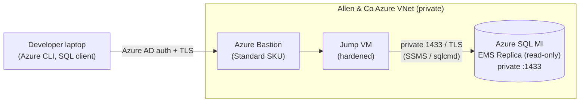
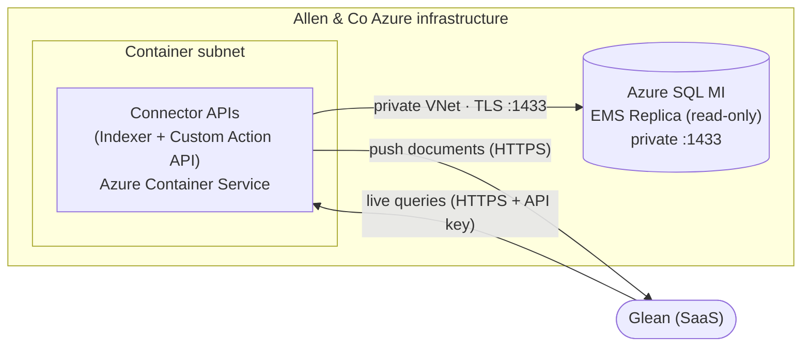

# Secure Database Connectivity — Glean Custom Connector for Allen & Co

## 1. Summary

This document covers two distinct goals. Knowing which is temporary and which is ongoing helps your team prioritize the provisioning work.

| Goal | Description | Duration |
|---|---|---|
| **Goal 1 — Developer access** | Nimble Gravity developers need direct, read-only access to the Azure SQL MI during the build phase to write and test queries. | **Temporary** — removed once the connector is live |
| **Goal 2 — Glean integration** | Secure HTTPS APIs deployed on Allen & Co's Azure infrastructure. Glean calls the APIs using an API key; the APIs query the database over Azure's private network. | **Ongoing** — permanent production configuration |

> 💡 The dev configuration is a temporary scaffold. The production configuration is a small, permanent footprint — an Azure Container Service, a single network rule, a passwordless managed identity, and an API key. **No Nimble Gravity infrastructure is involved in production** — Allen & Co owns, builds, deploys, and operates the connector; Nimble Gravity provides the source code and build/deploy tooling.

---

## 2. Architecture overview

### Goal 1 — Developer access (temporary)

During development, Nimble Gravity engineers need to connect to the Azure SQL MI to write and validate queries. Because the MI has no public endpoint, access is provided through **Azure Bastion** (Microsoft's managed, Azure AD–authenticated service) to a small **jump VM** inside the VNet — Bastion connects to VMs, not to a managed-instance database endpoint directly, so a lightweight jump VM is the supported entry point.

Connection flow:

- Developer authenticates to Azure using their provisioned guest Azure AD (Entra ID) account.
- Azure CLI opens a Bastion tunnel to the jump VM (`az network bastion tunnel`) — no public IP on the VM, no SSH keys to distribute, no IP allow-listing.
- From the jump VM, the developer runs SSMS / `sqlcmd` against the MI's private endpoint on `1433` (or port-forwards through the VM to a local port). Traffic is encrypted and authenticated end to end.



> 💡 No VPN required and no SSH keys to distribute — Azure AD controls who can open a tunnel through Bastion, and your team revokes access simply by disabling the guest account. This entire path is **temporary**: the jump VM, guest accounts, and Bastion dev access are removed once the connector is live.

### Goal 2 — Glean integration (ongoing / production)

In production, the Glean connector runs as HTTPS APIs deployed on **Allen & Co's Azure Container Service**. Nimble Gravity provides the source code and build/deploy tooling; **Allen & Co builds the images in their ACR, owns, deploys, and operates** the containers. Glean calls the APIs using an **API key** generated in Allen & Co's Glean admin console. The APIs connect to the Azure SQL MI over Azure's private network.

Connection flow:

- Glean → **HTTPS + API key** → Connector APIs (Allen & Co's Azure Container Service).
- Connector APIs → **private Azure VNet** → Azure SQL MI (port `1433`, read-only).
- The indexer also pushes the documents it builds **out** to the Glean Indexing API over HTTPS.



> 💡 No Nimble Gravity infrastructure is involved in production. All components run inside Allen & Co's Azure environment; Allen & Co deploys and operates the service.

---

## 3. What we connect to

The connector needs **read-only** access to a specific set of EMS views on the Azure SQL MI. Views in scope:

- `v_Attendee`
- `v_Attendee_Event`
- `v_Company`
- `v_Participation`

The connector only ever issues `SELECT` statements against these views. It never writes, and it has no access to base tables or any other database object. Glean document-level permissions are derived from your **Active Directory / Entra ID** groups, so each Glean user only sees what they are entitled to.

---

## 4. Provisioning checklists

### Checklist A — Developer access (temporary)

> ⚠ Everything in this checklist is **temporary**. Once the connector is live in production, Nimble Gravity's jump VM, guest accounts, and Bastion dev access should be removed.

**A1. Azure Bastion (Standard SKU)**
Deploy **Azure Bastion Standard SKU** in the VNet that has line-of-sight to the MI (the native-client tunnel feature requires Standard). If Bastion is already deployed, confirm it is Standard SKU.
- Note: Standard SKU costs roughly **$140/month**. Confirm whether it's already in place before provisioning.

**A2. Jump VM (hardened)**
A small, hardened VM (Windows or Linux — your choice; e.g. 1 vCPU / 1 GB) in the VNet, with line-of-sight to the MI on private `1433` and **no public IP**. Our developers reach it through Bastion and run SSMS / `sqlcmd` against the MI from there. Kept patched as part of your normal OS maintenance.

**A3. Azure AD guest accounts**
Provision guest accounts in your Azure AD (Entra ID) tenant for the following Nimble Gravity developers:

- Doug Poirier — doug@nimblegravity.com
- Gus Lago — Gustavo.lago@nimblegravity.com

Grant each account the RBAC needed to connect through Bastion:
- **Reader** on the Bastion resource
- **Reader** on the jump VM (and its resource group) so Bastion can resolve and connect to it

**A4. Read-only SQL login (dev)**
A dedicated SQL login for development, granted `SELECT` only on the in-scope views:

```sql
CREATE LOGIN glean_dev WITH PASSWORD = '<strong-secret>';
CREATE USER glean_dev FOR LOGIN glean_dev;
GRANT SELECT ON dbo.v_Attendee       TO glean_dev;
GRANT SELECT ON dbo.v_Attendee_Event TO glean_dev;
GRANT SELECT ON dbo.v_Company        TO glean_dev;
GRANT SELECT ON dbo.v_Participation  TO glean_dev;
```

**A5. Glean accounts for Nimble Gravity**
Provision Glean user accounts under your **allenandco.com** Glean tenant for Doug and Gus, so we can validate that indexed data surfaces correctly and that document-level permissions work before go-live.

### Checklist B — Production / Glean integration (ongoing)

> 💡 This is the permanent configuration. All infrastructure lives inside Allen & Co's Azure. Nimble Gravity provides the source code and build/deploy tooling — Allen & Co builds the images in their ACR, deploys, and operates the service.

**B1. Azure Container Service**
Provision an **Azure Container Service** (Azure Container Apps or equivalent) to host the connector APIs. Nimble Gravity provides the source code repository plus the build/deploy tooling; Allen & Co builds the two images in their own Azure Container Registry (`az acr build` — no local Docker needed), deploys the containers, and manages the service going forward.
- The container needs line-of-sight to the Azure SQL MI on port `1433` (see B2).
- The container needs a **public HTTPS endpoint** so Glean can reach it (see B3).

**B2. Network rule: container subnet → Azure SQL MI**
Add a single NSG rule allowing the container service to reach the MI over the private network:
- **Inbound to the MI subnet:** allow port `1433` from the container service subnet only.
- All other inbound to the MI remains denied.

No public endpoint needs to be enabled on the MI — the container connects over Azure's private network.

**B3. Glean connector configuration (API key)**
Allen & Co's Glean administrator generates an **API key** in the Glean admin console and configures the connector with the API endpoint URL (Nimble Gravity provides the URL once the container is deployed). The API key stays within the Allen & Co Glean environment. Nimble Gravity can assist with Admin access to the Glean admin console to create the data sources and custom actions.

**B4. Production database access — managed identity (passwordless)**
Production uses the connector's **managed identity** — no SQL login, no password. Grant
that identity `SELECT` on the in-scope views (run once as the Entra admin):

```sql
CREATE USER [<managed-identity-name>] FROM EXTERNAL PROVIDER;
GRANT SELECT ON dbo.v_Attendee       TO [<managed-identity-name>];
GRANT SELECT ON dbo.v_Attendee_Event TO [<managed-identity-name>];
GRANT SELECT ON dbo.v_Company        TO [<managed-identity-name>];
GRANT SELECT ON dbo.v_Participation  TO [<managed-identity-name>];
```

The connector authenticates as this identity from inside the container, so **no database
credentials are stored, shared, or handled by Nimble Gravity** in production. The dev
`glean_dev` login (A4) is the only SQL login, and it is temporary (removed at go-live).

**B5. Keep the MI private**
Leave the Azure SQL MI's public endpoint disabled. The container service connects over the private VNet path only.

---

## 5. What Nimble Gravity provides

- **Source code repository** so Allen & Co can inspect, audit, and build the connector.
- **Build & deploy tooling** (IaC + scripts) so Allen & Co builds the two images in their own
  Azure Container Registry (`az acr build` — no local Docker) and deploys them.
- **Deployment guidance and support** during initial setup and acceptance testing.
- **The API endpoint URL** (derived from the deployed container) for Glean admin configuration.
- **Ongoing support** for connector updates, bug fixes, and additional views as needed.

---

## 6. Security model

The production design applies defense in depth at every layer:

| Control | How it works |
|---|---|
| **Database never exposed to internet** | The MI public endpoint stays disabled. The only path in is from the container subnet over Azure's private network. |
| **API key authentication** | Glean includes the API key in every call; the key is generated and managed in Allen & Co's Glean admin console. Requests without a valid key are rejected. |
| **HTTPS encryption** | All traffic between Glean and the APIs is encrypted in transit. SQL traffic between the container and the MI uses Azure's private network with TLS. |
| **Least privilege at the database** | Production uses a read-only **managed identity** (a temporary read-only SQL login only during dev) with `SELECT` only on the four views — no writes, no base-table access. |
| **Tight network controls** | NSG rules restrict inbound to the MI subnet to the container subnet only, on port `1433`. |
| **All infrastructure owned by Allen & Co** | No Nimble Gravity systems are in the production data path. Allen & Co controls and audits the entire environment. |
| **Developer access via Azure AD** | Temporary dev access is gated by Azure AD guest accounts, through Bastion to a jump VM. Revoke by disabling the account — no SSH keys to track. |
| **Permissions mirror Active Directory** | Glean document access is derived from your AD/Entra groups — users only see what they are entitled to. |

---

## 7. Setup sequence

**Developer access (temporary — start immediately)**

1. Allen & Co provisions: Azure AD guest accounts (preferably allenandco.com), Bastion Standard SKU (if not already in place), the jump VM, RBAC roles, the dev SQL login, and Glean accounts for the Nimble Gravity developers.
2. Nimble Gravity confirms access and begins development.
3. Developer access is revoked once the connector passes acceptance testing.

**Production / Glean integration**

4. Nimble Gravity provides: source code repository, build/deploy tooling (IaC + scripts), and deployment guidance.
5. Allen & Co builds the two images in their ACR (`az acr build`), provisions the Azure Container Service, and deploys them.
6. Allen & Co provisions the NSG rule (container subnet → MI on `1433`) and grants the connector's **managed identity** `SELECT` on the four views.
7. Allen & Co confirms API-to-database connectivity from the container (managed identity). **No production database credentials are shared with Nimble Gravity.**
8. Allen & Co provides the API endpoint URL (from the deployed container) to configure Glean.
9. Allen & Co's Glean admin generates the API key in Glean and configures the connector endpoint.
10. Nimble Gravity and Allen & Co run the acceptance test together (§8).
11. Connector goes live. The jump VM, developer guest accounts, and Bastion dev access are removed.

---

## 8. Validation / acceptance test

Once the production configuration is in place, we confirm the connection together:

1. **API reachable** — Glean calls the API endpoint with the API key and receives a valid response.
2. **Database reachable** — the API connects to the MI over the private network and confirms TLS is in use.
3. **Read access confirmed** — `SELECT TOP 1` from each in-scope view (`v_Attendee`, `v_Attendee_Event`, `v_Company`, `v_Participation`).
4. **Permissions verified** — a test Glean user sees only the documents they are entitled to under AD/Entra groups.
5. **Resilience** — the API container is restarted and confirms it reconnects without manual intervention.

---

## 9. Anticipated questions

| Question | Answer |
|---|---|
| Can Nimble Gravity developers see production data during development? | Dev access uses a read-only login scoped to the same views, and is fully revoked before go-live. |
| How is the API key managed? | The Glean API key is generated in Allen & Co's Glean admin console and stays within your Glean environment. |
| How do we revoke Nimble Gravity's access when the project ends? | Disable the Azure AD guest accounts and remove the jump VM and Bastion RBAC assignments. In production, Nimble Gravity has no access — all infrastructure is owned and operated by Allen & Co. |
| Who maintains the container service long-term? | Allen & Co owns and operates the container service. Nimble Gravity can provide updates for new features or fixes. |
| What happens if the container restarts or fails? | The Azure Container Service handles restarts automatically. Glean's indexer retries on its next scheduled run; live queries recover automatically once the container is healthy. |
| Can additional views be added later? | Yes — a `GRANT SELECT` on the new view (Allen & Co), a rebuilt image (Allen & Co, `az acr build` from the updated source Nimble Gravity provides), and a redeployment (Allen & Co). No downtime required. |
| Who pays for Azure Bastion Standard SKU? | It is an Allen & Co cost within your Azure subscription (~$140/month). Confirm with your Azure team whether it is already deployed before provisioning. |

---

## 10. Information exchange checklist

**Nimble Gravity provides to Allen & Co**

| Item | Notes |
|---|---|
| Source code repository | Allen & Co inspects, audits, and builds from it |
| Build & deploy tooling (`build-images` / `deploy` scripts, IaC, `azure-pipelines.yml`) | Allen & Co builds the two images in their ACR (`az acr build`) and deploys |
| Deployment guidance | Step-by-step support during initial setup and acceptance testing |

**Allen & Co provides to Nimble Gravity**

| Item | Notes |
|---|---|
| Azure AD guest accounts | For Doug Poirier (doug@nimblegravity.com) and Gustavo Lago (Gustavo.lago@nimblegravity.com) |
| Bastion + jump VM access | For developers to open tunnels to the MI during dev |
| MI FQDN | `<mi-name>.<zone>.database.windows.net` |
| Dev SQL login + password | The temporary `glean_dev` login, via secure channel (dev only; removed at go-live) |
| ACR + **AcrPush** (to build) and **AcrPull** for the managed identity (runtime image pull) | Allen builds into, and the containers pull from, their own ACR |
| Container Apps environment, VNet/subnet, Key Vault (+ secrets), storage account (sync state) | The infra the connector deploys into |
| Managed identity with grants | `SELECT` on the four views + Key Vault Secrets User + Storage Blob Data Contributor (sync state) |
| Confirmation of NSG rule | Container subnet → MI on port `1433` |
| Glean accounts for Nimble Gravity team | Under the allenandco.com Glean tenant |
