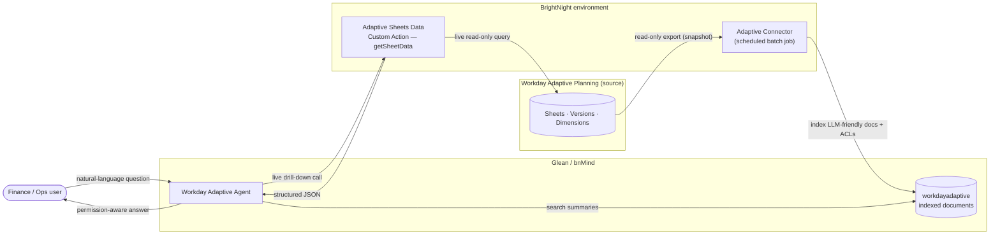
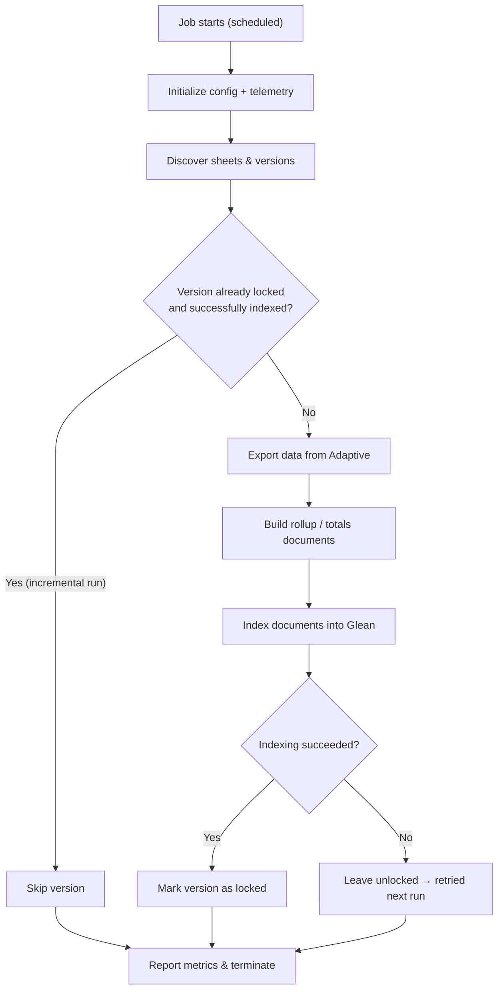
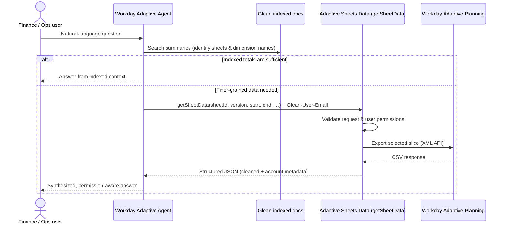

# Workday Adaptive Planning Connector & Custom Action

> **Functional documentation** — what this product does and how it is used.
> Finance and operations teams ask natural-language questions in **bnMind (Glean)** and receive accurate, **permission-aware** answers sourced from **Workday Adaptive Planning** — without manually opening sheets, re-applying filters, or exporting reports.

---

### About this document

| | |
|---|---|
| **Scope** | Functional reference — capabilities, data model, flows, configuration knobs, monitoring. Step-by-step Azure/Glean deployment is intentionally summarized (see the full manual for those procedures). |
| **Source of truth** | *Manual — Workday Adaptive Planning Connector and Custom Action* (Nimble Gravity, v1.0). Everything here is grounded in that manual. |
| **Audience** | Anyone operating, configuring, or explaining the product (FP&A/ops users, administrators, engineers). |
| **Environment** | BrightNight's **bnMind** (Glean) tenant, with components hosted in BrightNight's Azure subscription. |

---

## Table of contents

1. [Overview](#1-overview)
2. [How it works at a glance](#2-how-it-works-at-a-glance)
3. [Data model & entities](#3-data-model--entities)
4. [The Connector — snapshot indexing](#4-the-connector--snapshot-indexing)
5. [The Custom Action — "Adaptive Sheets Data" (`getSheetData`)](#5-the-custom-action--adaptive-sheets-data-getsheetdata)
6. [The Workday Adaptive Agent — orchestration](#6-the-workday-adaptive-agent--orchestration)
7. [Permissions & security model](#7-permissions--security-model)
8. [Configuration reference](#8-configuration-reference)
9. [Monitoring & observability](#9-monitoring--observability)
10. [Prerequisites](#10-prerequisites)
11. [Glossary](#11-glossary)

---

## 1. Overview

BrightNight's FP&A and project-development teams rely on **Workday Adaptive Planning** for budgeting, forecasting, and project-level financials. Answering even routine questions usually means remembering which sheets/reports to open, re-applying filters (version, time period, legal entity, dimensions), and exporting to Excel before sharing — slow work, especially during month-end close and portfolio reviews.

This product lets users instead **ask bnMind directly**, for example:

- *"What was our budget for the Box Canyon project for 2024?"*
- *"What's the remaining budget for permitting expenses across all US solar projects this quarter?"*
- *"Which projects are more than 10% over total CapEx budget this year?"*

…and receive precise, **permission-aware** answers grounded in Adaptive.

### The connector + custom action + agent pattern

The solution is built on three cooperating pieces:

| Layer | Component | Role |
|---|---|---|
| **Snapshot** | **Adaptive Connector** | Scheduled batch job that indexes Adaptive data as LLM-friendly Glean documents, each carrying access-control lists (ACLs). |
| **Live drill-down** | **Adaptive Sheets Data** (Custom Action) | HTTP endpoint that retrieves exact slices of sheet data on demand. |
| **Orchestration** | **Workday Adaptive Agent** | Searches the indexed documents, decides when to invoke the custom action, and formats the final answer. |

This separation enables **fast semantic Q&A against summaries** for most questions, and **precise, up-to-date numbers** for detailed drilldowns — without trying to fully index multi-GB sheets.

### Functional architecture



> ℹ️ For complex or multi-step questions, the dedicated **Workday Adaptive Agent** is the recommended entry point — it is purpose-configured for Adaptive's sheets, dimensions, and tools.

---

## 2. How it works at a glance

There are **two ways data reaches an answer**, and the agent chooses between them:

1. **From the snapshot (indexed documents).** The connector periodically exports key Adaptive sheets into compact, LLM-friendly Glean documents (rollups/totals, plus catalogs of sheets, versions, and dimensions). Most questions are answered directly from these.

2. **From a live drill-down (custom action).** When the indexed totals aren't specific enough (a particular project, vendor, cost center, or month-level breakdown), the agent calls the **Adaptive Sheets Data** action, which queries Adaptive live and returns the exact slice.

> ✅ **Rule of thumb:** summaries for most questions, live drill-down for precise numbers. Both paths enforce the same permission model.

---

## 3. Data model & entities

### 3.1 Source entities in Adaptive

| Entity | Description |
|---|---|
| **Sheets** | Primary source of numeric data. |
| **Versions** | Budget, Actuals, Forecast, and custom working versions (e.g., `1+11`, `2+10`). |
| **Dimensions** | Project, vendor, task/sub-function, GL account, legal entity, etc. |
| **Levels / Legal Entities** | Organizational layers (e.g., *BrightNight US LLC*) used for roll-up and security. |
| **Users & Roles** | Finance managers, planners, and operational finance — they drive document ACLs. |

### 3.2 Indexed document types in Glean (produced by the connector)

The connector produces several well-defined document types that together give the agent enough context to reason about Adaptive **without** pulling entire sheets into the index.

| Document type | Granularity | What it contains |
|---|---|---|
| **Totals / Rollup** | per *sheet × year × version* | The rollup view of a single sheet for a specific version and year (e.g., *"B4 OpEx, Version = Budget 2026, Year = 2026"*). Only roll-up columns (totals by project, task, period, or equivalent). Includes sheet metadata (name, description, type), version identifier, normalized year/date range, roll-up dimensions, cleaned/normalized aggregated values, and a **View URL** back to the Adaptive UI. |
| **Sheet Catalog** | catalog | All Adaptive sheets available to the connector and custom action. Per sheet: name, code/ID, description, sheet type, and column/dimension names. Lets the agent discover sheet structure before routing a question. |
| **Version Catalog** | catalog | The Adaptive versions the connector and custom action can work with. Per version: name, internal identifier, available date range, and description (Actuals, Budget, or Forecast). |
| **Dimension Catalog** | catalog | Available values for key dimensions (projects, vendors, cost centers, subfunctions). Per dimension: name and full list of values (display names and/or codes). Helps the agent normalize and validate user-provided entities before building a custom action call. |

> ℹ️ **All documents include security context** (allowed users/groups) derived from Adaptive — see [§7 Permissions & security model](#7-permissions--security-model).

> ⚠️ **Full, row-level sheet indexing is technically possible via configuration but is strongly discouraged in production** (size). For fine-grained data, use the **Adaptive Sheets Data** custom action instead.

---

## 4. The Connector — snapshot indexing

The connector is a **batch job, not a service**. Each execution initializes configuration and telemetry, discovers sheets/versions, exports data, builds documents, indexes them in Glean, reports metrics, and **terminates**. There is no long-lived HTTP API.

### 4.1 What happens on each run

By default the connector runs **daily** (configurable to run more frequently during close week). At the start of each run it checks which versions are already done and skips them, then processes the rest:



### 4.2 Indexing mode — incremental vs. full refresh

Controlled by `GLEAN_FULL_REFRESH`:

| Mode | API used | Behavior |
|---|---|---|
| **Incremental** *(default, `false`)* | `/indexdocuments` | Adds or updates the documents in the current batch. Existing documents **not** in the batch are preserved. |
| **Full refresh** *(`true`)* | `/bulkindexdocuments` | **Deletes all existing documents** in the data source, then re-indexes everything. |

> ℹ️ Use full refresh **only** when a complete re-index is explicitly needed (e.g., after a data-model change or to clean up stale documents). For normal operations, incremental is recommended.

### 4.3 Version locking (skip-already-indexed)

To avoid reprocessing the same data every run, successfully indexed versions are recorded as **locked** in Azure Table Storage. On the next run, locked versions are skipped entirely.

- Lock rows are written **only after** document indexing succeeds — so a **partial or failed run never marks a version as locked**.
- Version locking is **ignored when `GLEAN_FULL_REFRESH=true`** (a full refresh processes all versions regardless).
- If locking is disabled (no connection string configured), **all versions are processed on every run**.

### 4.4 What gets exported

| Output | Controlled by | Notes |
|---|---|---|
| **Rollup / totals exports** | `ADAPTIVE_GENERATE_TOTALS_EXPORTS` *(default on)* | The LLM-friendly documents actually indexed into Glean — the connector's primary output. |
| **Full row-level exports** | `ADAPTIVE_GENERATE_FULL_EXPORTS` *(default off)* | Useful for debugging; **not recommended for indexing in production** due to size. |

### 4.5 Scoping & granularity

- **Which sheets are indexed** is controlled by `ADAPTIVE_SHEET_NAMES_ALLOWLIST` — see [§8.3](#83-choosing-which-sheets-to-index).
- **Dimension granularity:** by default, rollups collapse all children of a dimension into a single aggregate. Listing a dimension in `ADAPTIVE_CLEAN_EXPORTS_KEEP_DIMENSION_CHILDREN` preserves its breakdown (e.g., keep individual *subfunctions* instead of one total) when that detail matters for the agent's answers.

---

## 5. The Custom Action — "Adaptive Sheets Data" (`getSheetData`)

When the pre-indexed totals aren't specific enough, the agent calls this action to retrieve an **exact slice of a sheet, live from Adaptive**.

> **When it's used:** "to retrieve planning sheet data from Adaptive when the total sheets available from the data source are not sufficient and more specific data is required." It is invoked **after** searching indexed documents — the caller needs the **sheet ID** and **version name**, both available in every indexed document and in the Sheet/Version catalogs.

### 5.1 Inputs

| Parameter | Type | Required | Description |
|---|---|:---:|---|
| `sheetId` | string | ✅ | Adaptive sheet to query (e.g., *"B4. OpEx – Expenses by Vendor"*, ID `859`). |
| `version` | string | ✅ | Adaptive planning version name (e.g., `Actual`, `Budget`, `Forecast`). |
| `start` | string | ✅ | Start period, `M/YYYY` or `MM/YYYY`. |
| `end` | string | ✅ | End period, `M/YYYY` or `MM/YYYY`. |
| `searchText` | string | ❌ | Semicolon-separated search terms (e.g., project codes, vendor names). |
| `includeAllChildrenForDimension` | string | ❌ | Dimension name for full hierarchy expansion. |

### 5.2 Behavior

- Each `searchText` term is resolved by **fuzzy matching** to the closest dimension value.
- The Adaptive sheet export APIs are called for the selected slice.
- The result is **cleaned**: floats rounded to two decimals, empty columns dropped (but documented), and display names used as keys.

### 5.3 Request flow



### 5.4 Output

A structured, **flat** JSON payload:

```json
{
  "response": {
    "data": {
      "dimensionFields": [ "..." ],
      "accounts": [ "..." ],
      "droppedEmptyPeriodFields": [ "..." ],
      "series": [ "..." ],
      "seriesCount": 0
    },
    "includeAllChildrenForDimension": null,
    "matchedSearches": [
      {
        "columnName": "<dimension name>",
        "displayName": "<matched value>"
      }
    ],
    "sheet": {
      "id": "<sheet id>",
      "name": "<sheet display name>",
      "type": "<sheet type>"
    }
  }
}
```

### 5.5 Identity & authentication

In Glean, the action's **Authentication is set to `None`**. Caller identity is resolved exclusively from the **`Glean-User-Email`** header that Glean forwards on every request; the backend then authenticates against Adaptive using the configured **read-only service account** and applies the permission-mapping rules.

> ℹ️ **Glean does not host the action logic.** The backend is owned and operated by BrightNight / Nimble Gravity, which is responsible for its reliability, monitoring, latency, and debugging. The action schema must stay **simple and flat** — deeply nested JSON payloads are not supported.

---

## 6. The Workday Adaptive Agent — orchestration

The agent is the recommended entry point for non-trivial questions. It searches the indexed documents to identify the right sheets and confirm dimension names, decides whether the indexed totals already answer the question, and — only if needed — calls the custom action before synthesizing the final answer.

| Setting | Value |
|---|---|
| **Name** | Workday Adaptive Agent |
| **Description** | "Searches and analyzes financial and planning data within Workday Adaptive, selecting relevant sheets and catalogs to answer detailed or aggregated user questions. Use it for precise, data-driven insights on budgets, forecasts, and reports." |
| **Model** | Claude Opus 4.6 |

> ℹ️ **What governs when the action fires:**
> - In the **bnMind Assistant/Chat** (action used directly), the action's **trigger condition** description governs invocation.
> - When the action is added as a **step inside the Workday Adaptive Agent**, the **agent's own instructions** govern invocation instead.

The agent's full system prompt is maintained in the connector repository (the `agent_system_prompt` markdown file) and is the reference to use when recreating or updating the agent.

---

## 7. Permissions & security model

Permissions are enforced even though **Glean and Adaptive are *not* SSO-linked**:

- An explicit **identity-mapping layer** plus **Glean ACLs** ensure users see only what they can access in Adaptive.
- **Indexed documents carry security context** (allowed users/groups) derived from Adaptive, so the snapshot path is permission-aware by construction.
- For the **live path**, the custom action resolves the caller from the `Glean-User-Email` header and validates user permissions before returning data ([§5.5](#55-identity--authentication)).
- All access to Adaptive — both connector and custom action — uses a single **dedicated read-only service account**.

---

## 8. Configuration reference

All connector behavior is controlled **exclusively through environment variables** — no code changes are required to adjust scope, behavior, or credentials.

> ℹ️ **Where these live:** in staging/production they are set on the hosting components' environment settings; for local development they live in a `.env` file. **Secrets** (credentials, API tokens) should be stored in a secret store and injected by reference — never pasted in plaintext.

### 8.1 Connector environment variables

**Adaptive XML API credentials** — required for all sheet exports and dimension data:

| Variable | Description |
|---|---|
| `ADAPTIVE_BASE_URL` | Base URL for the Adaptive XML API. Default: `https://api.adaptiveplanning.com/api/v40`. |
| `ADAPTIVE_CALLER_NAME` | Identifier sent in API calls. Typically `adaptive-connector`. |
| `ADAPTIVE_LOGIN` | Username of the dedicated read-only Adaptive service account. |
| `ADAPTIVE_PASSWORD` | Password for the service account. Store as a secret and inject by reference. |
| `ADAPTIVE_TIMEOUT_SECONDS` | Request timeout in seconds. Defaults to `60`; increase for large sheets. |

**Adaptive Modeling REST API** — used by utility scripts (e.g., `sheet_availability.py`) and optionally by the connector to pre-filter unavailable columns/items before `exportData`:

| Variable | Description |
|---|---|
| `ADAPTIVE_MODELING_BASE_URL` | Base URL for the Adaptive Modeling REST API. |
| `ADAPTIVE_TENANT` | Adaptive tenant identifier. |

**Glean Indexing API** — controls how and whether documents are pushed to Glean:

| Variable | Description |
|---|---|
| `GLEAN_ENABLE_INDEXING` | `true` to push documents to Glean; `false` for a dry-run / local testing. |
| `GLEAN_INSTANCE` | Glean tenant identifier (e.g., `brightnight`). |
| `GLEAN_INDEXING_API_KEY` | Indexing API token (generated in the Glean Admin Console). Store as a secret. |
| `GLEAN_DATASOURCE` | Unique name of the Glean data source to index into (e.g., `workdayadaptive`). |

**Export generation** — which document types are produced per run:

| Variable | Default | Description |
|---|:---:|---|
| `ADAPTIVE_GENERATE_TOTALS_EXPORTS` | `true` | Generates the rollup/totals exports actually indexed into Glean — the primary output. |
| `ADAPTIVE_GENERATE_FULL_EXPORTS` | `false` | Generates full row-level exports per sheet. Debugging only; not recommended for production indexing. |

**Indexing mode:**

| Variable | Default | Description |
|---|:---:|---|
| `GLEAN_FULL_REFRESH` | `false` | `true` → `/bulkindexdocuments` (deletes all existing docs, then re-indexes). `false` → `/indexdocuments` (adds/updates the batch; others preserved). |

**Dimension granularity:**

| Variable | Example | Description |
|---|---|---|
| `ADAPTIVE_CLEAN_EXPORTS_KEEP_DIMENSION_CHILDREN` | `Subfunction` | Comma-separated list (or JSON array) of dimensions that should keep their individual children even when rolled up. By default, rollup collapses children into a single aggregate. |

**Version locking (Table Storage):**

| Variable | Default | Description |
|---|---|---|
| `LOCKED_VERSION_INDEX_TABLE_CONNECTION_STRING` | *(empty)* | Connection string for the Azure Storage account holding the lock table. **If empty, version locking is disabled and all versions are processed every run.** |
| `LOCKED_VERSION_INDEX_TABLE_NAME` | `processedDocuments` | Name of the table where locked versions are recorded. |
| `LOCKED_VERSION_INDEX_PARTITION_KEY` | `workdayadaptive` | Partition key used when writing lock records. |

**Logging:**

| Variable | Default | Description |
|---|:---:|---|
| `LOG_DEBUG` | `false` | `true` enables verbose DEBUG logs. Useful locally; avoid in production due to log volume. |

### 8.2 Custom Action definition (in Glean)

| Field | Value |
|---|---|
| **Display name** | Adaptive Sheets Data |
| **Description** | Retrieve filtered slices of Adaptive sheets by version, period, and dimension filters. |
| **Action type** | Read |
| **Authentication** | None — environment-based; Glean passes the `Glean-User-Email` header and the backend uses the configured Adaptive service account per the permission-mapping rules. |

### 8.3 Choosing which sheets to index

By default the connector indexes **all** Adaptive sheets it can access. To restrict the set (reduce processing time, limit scope during testing, or exclude irrelevant sheets), set `ADAPTIVE_SHEET_NAMES_ALLOWLIST` to a JSON array of **exact** sheet display names.

| Variable | Type | Default | Description |
|---|---|---|---|
| `ADAPTIVE_SHEET_NAMES_ALLOWLIST` | JSON array (string) | *(unset — all sheets)* | If set, only sheets whose name matches an entry are processed; all others are skipped. |

Example value:

```json
["B4. OPEX - Expenses by Vendor","B7. OpEx - Expense Summary","C2. RPP - Project Supply","E2. PROJECT Planning","E2. PROJECT Planning (Gas)","F1. AOM Planning","AVF Model","AVF Summary","B2. OpEx - Personnel Summary"]
```

> ⚠️ Sheet names must match **exactly** as they appear in Workday Adaptive Planning (**case-sensitive**).

> 💡 To re-enable full indexing, remove the variable or set it to an empty array `[]`. To force a full re-index after changing the allowlist, also set `GLEAN_FULL_REFRESH=true` for that run, then revert it afterward.

---

## 9. Monitoring & observability

Both components are instrumented and expose pre-built **Azure Monitor Workbooks** — the primary tool for day-to-day health monitoring and troubleshooting — plus **alert rules** that email a configured recipient group on failures.

### 9.1 Custom Action Workbook (Adaptive Sheets Data)

Monitors all live `getSheetData` calls made by the agent or the bnMind Assistant.

**All Calls Overview (Last Week)** — full log of executions (first 250 rows per query window):

| Column | Description |
|---|---|
| `timestamp` | Date/time of the call. |
| `success` | Whether the call returned a successful response. |
| `http_status` | HTTP status code (e.g., `200`, `502`). |
| `reason` | Human-readable result or error message. |
| `sheet_id` | Adaptive sheet queried (e.g., `859`). |
| `version` | Adaptive version used (e.g., `Actuals`, `Budget`). |
| `start` / `end` | Date range requested (`M/YYYY`). |
| `search_text_preview` | Semicolon-separated search terms sent (e.g., `YUMA;TRAN`). |
| `duration_s` | Response time in seconds. |
| `included_children` | Whether `includeAllChildrenForDimension` was used. |

**Failure Detail Log (Last Week)** — only failed calls, for hands-on troubleshooting: `timestamp`, `reason`, `http_status`, `sheet_id`, `version`, `search_text_preview`, `duration_s` (time elapsed before failure — useful for spotting timeout patterns).

**Success Rate (Last Week)** — time-series of total calls, successes, and failures with a calculated success-rate %. Use it to detect degradation windows or recurring failure patterns.

### 9.2 Connector Workbook (Adaptive Connector)

Monitors all scheduled indexing runs.

**Indexing Run History (Latest 7 Days):**

| Column | Description |
|---|---|
| `timestamp` | Start time of the run. |
| `run_id` | Unique identifier for the run (UUID). |
| `indexing_success` | Whether the run completed without errors. |
| `indexing_mode` | `incremental` (skips locked versions) or `full_refresh` (reprocesses all). |
| `documents_indexed` | Number of documents pushed to Glean in that run. |
| `duration_seconds` | Total execution time. |
| `indexing_enabled` | Whether indexing was active for that run. |

**Documents Indexed Over Time (By Month)** — trend of successfully indexed documents per run, split by mode. *(Tip: if incremental runs suddenly drop to 0, it may mean all versions are locked and no new data is being picked up.)*

**Failed Runs Detail (Last 7 Days)** — all failed runs with run ID, mode, and duration. *(Tip: runs that consistently fail at a specific duration may be hitting the job's timeout limit.)*

### 9.3 Alert rules

All alerts email the configured Action Group recipients.

| Alert | Condition | Severity | Purpose |
|---|---|---|---|
| **Custom Actions Calls Failure** | `success_rate < 70` | 2 — Warning | Fires when more than 30% of `getSheetData` calls fail within the window; indicates a degraded backend or upstream Adaptive issues. |
| **Indexing Failure Alert** | `false_count > 2` | 1 — Error | Fires when more than 2 connector runs fail to index; the highest-severity alert — the connector is not keeping bnMind up to date. |

> 💡 Notification recipients are managed in the linked **Action Group** — addresses can be added/removed **without** modifying the alert rules or redeploying anything.

---

## 10. Prerequisites

Functional access required to operate the product:

| Area | Access |
|---|---|
| **Adaptive** | A dedicated **read-only** service account scoped to the relevant finance sheets (shared by the connector and the custom action). |
| **Glean / bnMind** | Admin or Setup Admin role, able to configure custom data sources, generate Indexing API tokens, create custom actions, and manage the Workday Adaptive Agent. |
| **Hosting (Azure)** | Rights to manage the connector job, the custom-action backend, the secret store, and observability resources. |

> ℹ️ The full step-by-step **deployment and Glean setup** procedures (data-source creation, object-type definitions, token generation, Function App publishing, agent wiring) live in the source manual and are intentionally out of scope for this functional document.

---

## 11. Glossary

| Term | Meaning |
|---|---|
| **bnMind** | BrightNight's Glean tenant — the enterprise search + AI assistant where users ask questions. |
| **Glean data source** | A registered namespace in Glean (here, `workdayadaptive`) under which indexed documents live. |
| **Connector** | The scheduled batch job that snapshots Adaptive sheets into Glean documents. |
| **Custom Action** | An on-demand HTTP endpoint (`getSheetData`) the agent calls for live, fine-grained data. |
| **Rollup / totals** | Aggregated sheet values (by project, task, period…) — the LLM-friendly form that gets indexed. |
| **Version** | An Adaptive planning scenario: Actuals, Budget, Forecast, or a custom working version. |
| **Dimension** | An analysis axis in Adaptive (project, vendor, subfunction, GL account, legal entity…). |
| **ACL** | Access Control List — the allowed users/groups attached to each indexed document. |
| **Version locking** | Recording a successfully indexed version so future incremental runs skip it. |

---

*Source: Manual — Workday Adaptive Planning Connector and Custom Action (Nimble Gravity, v1.0, April 2026). This functional document reflects the product as described in that manual.*
